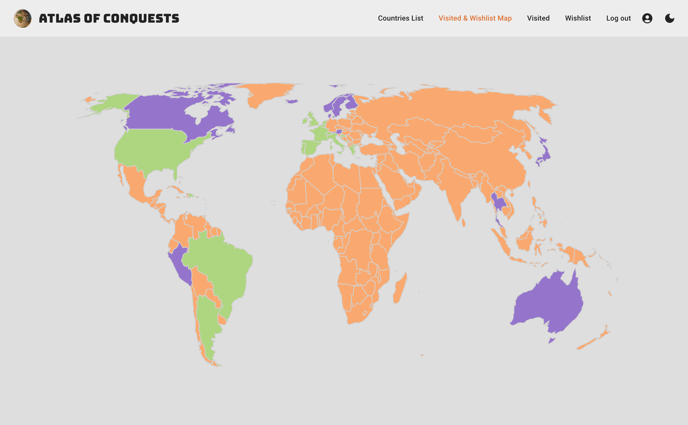

# Atlas of Conquests

​
<br>
​


## Description

​
Travel registering App that allows users to keep a record of the countries they already visited and those they wish to visit, with useful and constantly updated information for each country.
​
<br>
​

## Data

​
Country Information
​

```json
[
  {
    "name": {
      "common": "Portugal",
      "official": "Portuguese Republic",
      "nativeName": {
        "por": {
          "official": "República português",
          "common": "Portugal"
        }
      }
    },
​
    "cca2": "PT",
    "currencies": {
      "EUR": {
        "name": "Euro",
        "symbol": "€"
      }
    },
​
    "capital": ["Lisbon"],
    "region": "Europe",
    "subregion": "Southern Europe",
    "languages": {
      "por": "Portuguese"
    },
    "borders": ["ESP"],
    "area": 92090.0,
    "flag": "🇵🇹",
    "maps": {
      "googleMaps": "https://goo.gl/maps/BaTBSyc4GWMmbAKB8",
      "openStreetMaps": "https://www.openstreetmap.org/relation/295480"
    },
    "population": 10305564,
    "timezones": ["UTC-01:00", "UTC"],
    "continents": ["Europe"]
  }
]
```

​
Attractions (example)
​

```json
​
 "France": {
    "attractions": ["Eiffel Tower", "Louvre Museum", "Mont Saint-Michel"],
    "country_code": "FR"
  },
​
  "Italy": {
    "attractions": ["Colosseum", "Venice", "Amalfi Coast"],
    "country_code": "IT"
  },
​
  "Portugal": {
    "attractions": [
      "Mosteiro dos Jerónimos",
      "Centro Cultural de Belém",
      "Pena Palace"
    ],
    "country_code": "PR"
  },
​
  "United Kingdom": {
    "attractions": ["Buckingham Palace", "Stonehenge", "The British Museum"],
    "country_code": "GB"
  },
​
  "Spain": {
    "attractions": ["Sagrada Familia", "Alhambra", "Park Güell"],
    "country_code": "ES"
  },
```

Pexels API (example)

```json
{
  "page": 1,
  "per_page": 15,
  "photos": [
    {
      "id": 5069521,
      "width": 3648,
      "height": 5472,
      "url": "https://www.pexels.com/photo/people-walking-in-front-of-jeronimos-monastery-5069521/",
      "photographer": "Max Avans",
      "photographer_url": "https://www.pexels.com/@maxavans",
      "photographer_id": 3334879,
      "avg_color": "#636F67",
      "src": {
        "original": "https://images.pexels.com/photos/5069521/pexels-photo-5069521.jpeg",
        "large2x": "https://images.pexels.com/photos/5069521/pexels-photo-5069521.jpeg?auto=compress&cs=tinysrgb&dpr=2&h=650&w=940",
        "large": "https://images.pexels.com/photos/5069521/pexels-photo-5069521.jpeg?auto=compress&cs=tinysrgb&h=650&w=940",
        "medium": "https://images.pexels.com/photos/5069521/pexels-photo-5069521.jpeg?auto=compress&cs=tinysrgb&h=350",
        "small": "https://images.pexels.com/photos/5069521/pexels-photo-5069521.jpeg?auto=compress&cs=tinysrgb&h=130",
        "portrait": "https://images.pexels.com/photos/5069521/pexels-photo-5069521.jpeg?auto=compress&cs=tinysrgb&fit=crop&h=1200&w=800",
        "landscape": "https://images.pexels.com/photos/5069521/pexels-photo-5069521.jpeg?auto=compress&cs=tinysrgb&fit=crop&h=627&w=1200",
        "tiny": "https://images.pexels.com/photos/5069521/pexels-photo-5069521.jpeg?auto=compress&cs=tinysrgb&dpr=1&fit=crop&h=200&w=280"
      },
      "liked": false,
      "alt": "People Walking in Front of Jeronimos Monastery"
    }
  ]
}
```

OpenWeather API (example)

```json
{
  "lat": 33.44,
  "lon": -94.04,
  "timezone": "America/Chicago",
  "timezone_offset": -18000,
  "current": {
    "dt": 1684929490,
    "sunrise": 1684926645,
    "sunset": 1684977332,
    "temp": 292.55,
    "feels_like": 292.87,
    "pressure": 1014,
    "humidity": 89,
    "dew_point": 290.69,
    "uvi": 0.16,
    "clouds": 53,
    "visibility": 10000,
    "wind_speed": 3.13,
    "wind_deg": 93,
    "wind_gust": 6.71,
    "weather": [
      {
        "id": 803,
        "main": "Clouds",
        "description": "broken clouds",
        "icon": "04d"
      }
    ]
  }
}
```

<br>
​

## API's

​
[Rest Countries](https://restcountries.com/)

[Pexels API](https://www.pexels.com/api/)

[OpenWeather API](https://openweathermap.org/)

[Google Maps API](https://mapsplatform.google.com/)

​
<br>

## Packages

​
​
[axios](https://www.axios-http.com)

[React Simple Maps](https://www.react-simple-maps.io/)

​[Moment Timezone](https://momentjs.com/timezone/)

[React Tooltip](https://react-tooltip.com/)

[Country-Timezone](https://github.com/mountainfirefly/country-timezone#readme)

[@react-google-maps/api](https://github.com/JustFly1984/react-google-maps-api)

​[Material UI](https://mui.com/material-ui/)

[Tailwind CSS](https://tailwindcss.com/)

[vite-plugin-pwa](https://github.com/vite-pwa/vite-plugin-pwa)
<br>​

## Links

### Git

Frontend: [https://github.com/anapatriciagomes/AtlasOfConquests]()

Backend: [https://github.com/anapatriciagomes/AtlasOfConquestsBackEnd]()
​

[Deploy Link]()
​

### Contributors

​
Ana Patrícia Gomes - [`<anapatriciagomes>`](https://github.com/anapatriciagomes) - [`<Linkedin>`](https://www.linkedin.com/in/anapatriciagomes/)

Ruben Abreu - [`<ruben-abreu>`](https://github.com/ruben-abreu) - [`<Linkedin>`](https://www.linkedin.com/in/ruben-abreu1/)
